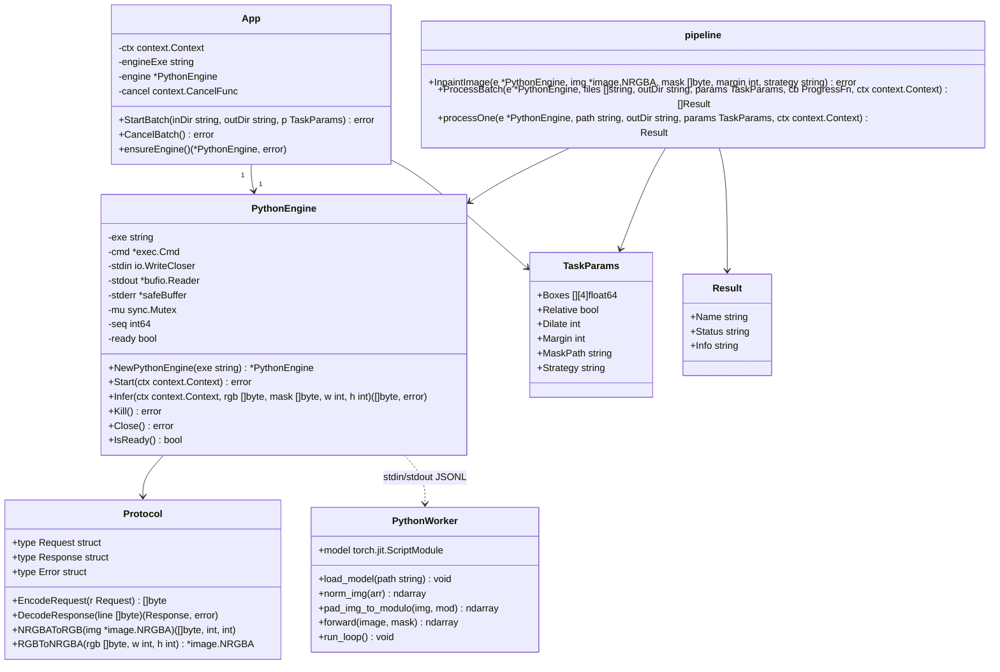
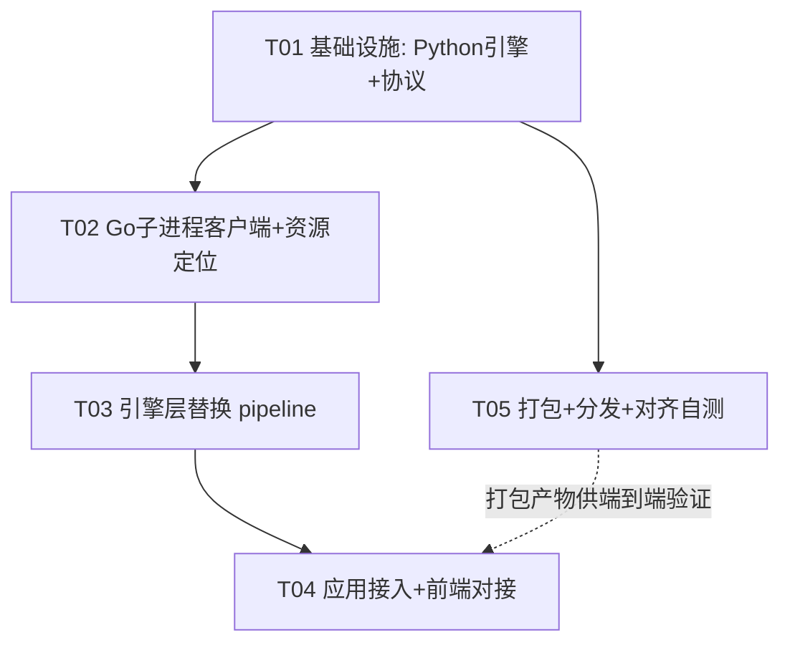

# 系统设计：去水印引擎效果对齐 IOPaint（big-lama PyTorch 子进程改造）

> 作者：高见远（架构师）｜日期：2026-09-08
> 项目：`lama-watermark-eraser`
> 上游 PRD：`docs/prd-incremental-iopaint-alignment.md`（含主理人决策纪要）

本文为增量改造的系统设计与任务分解，供工程师（任务 #13）按序实现、QA（任务 #14）按验收点验证。设计以 PRD 的 P0 红线为硬约束，所有「效果对齐」细节均以 IOPaint 官方实现为唯一基准。

---

# Part A：系统设计

## 1. 实现方案与框架选型

### 1.1 核心难点分析

| 难点 | 说明 | 设计取向 |
|------|------|----------|
| **效果下限（P0 红线）** | 新版输出必须 ≥ IOPaint（big-lama 默认），只能等于或优于 | 逐字复刻 IOPaint 的 `norm_img` / `pad_mod=8` / `mask>0` / `clip(*255)`，禁止任何 ONNX 转换 |
| **架构切换** | 从 Go 内嵌 ONNX → Go 主程序 + Python 子进程（PyInstaller exe） | Go 只做调度/IO/贴回，推理完全下沉 Python |
| **原生分辨率推理** | 废除 512 固定画布，big-lama 全卷积支持任意尺寸 | Python 侧 pad mod 8 后直接前向，不再缩 512 |
| **常驻子进程通信** | 单进程常驻、模型加载一次、批量复用，避免管道死锁 | stdin/stdout JSONL + stderr 独立排空 + 同步请求/响应 + 超时 kill |
| **取消语义** | 推理中取消需尽快终止且不产出半成品 | 取消即 kill 进程树，落盘前 ctx 检查点 |
| **体积/启动** | PyInstaller 打包 torch 数百 MB，首启动解压/加载慢 | onedir（解压一次）+ CPU wheel + 精简隐藏导入 + 可见预热状态 |

### 1.2 Python 侧技术栈

- **运行时**：Python 3.10（torch 2.x CPU wheel 兼容性最稳，避免 3.11/3.12 与旧 TorchScript 的潜在 ABI 问题）。
- **推理框架**：PyTorch **CPU 版**（`torch` 2.2–2.4 + `numpy` 1.26.x）。
- **big-lama 加载方式**：`torch.jit.load("big-lama.pt", map_location="cpu")` → `model.eval()`，即 IOPaint 官方同源的 TorchScript JIT 权重（Sanster/models `big-lama.pt`，Apache-2.0）。**不 import 任何 IOPaint 包**，而是把 IOPaint `iopaint/model/lama.py` 的 `forward()` 预处理/后处理逻辑**内联复制**为独立 `inpaint_core.py`，避免引入 IOPaint 全家桶依赖（体积/启动都更可控）。
- **推理细节**：`torch.no_grad()` + `torch.set_num_threads(0)`（0=使用系统默认线程数；效果优先，禁用半精度）。全 fp32。
- **图片解码**：Go 侧已完成解码（`image.NRGBA`），Python 侧只接收原始 RGB888 字节，**不依赖 PIL 解码**（PIL 仅作为开发/调试可选项），从而从根上消除「两版图片解码不一致」导致的效果偏差。

### 1.3 Go↔Python 通信方案对比与选定

| 方案 | 优点 | 缺点 | 结论 |
|------|------|------|------|
| **stdin/stdout JSONL 行协议** | 天然双向流、无端口冲突、无临时文件生命周期、天然适配常驻进程、跨平台、单机本地管道吞吐足够 | 需防管道死锁；大 base64 需控制读取缓冲 | ✅ **选定（主通道）** |
| 临时文件目录轮询 | 简单 | 每请求轮询延迟、临时文件清理复杂、与「常驻进程」配合别扭 | ❌ |
| TCP localhost / 命名管道 | 适合大二进制、可路由 | 端口分配/防火墙弹窗（Windows）、命名管道 Windows 有坑、setup 重 | ❌（备选，不采用） |
| 共享内存/内存映射 | 极快 | 复杂度高、跨语言易错 | ❌ |

**选定结论**：`stdin/stdout` 上的 **JSONL（每行一个 JSON）** 控制+数据一体协议。理由：本地管道吞吐 >100MB/s，1080p 单张 base64 往返开销相对 torch 秒级推理可忽略；无端口/防火墙/临时文件三类坑；同步「请求→响应」半双工天然避免管道互锁（详见 1.5）。

**图像/掩膜传递**：请求内嵌 **base64**（标准库 `StdEncoding`，ASCII 安全），图像为原始 **RGB888 行优先**（无 stride）、掩膜为**单通道 0/255**。确定性无损、无编解码误差（PNG 虽无损但有编解码 CPU 开销且引入像素转换路径）。协议预留可选 `file_path` 字段，P2 超大图（>20MP）可切换为落盘传输，主逻辑不变。

### 1.4 进程管理方案

- Go 用 `os/exec.Command(exe)` 常驻拉起，配置 `StdinPipe`/`StdoutPipe`/`StderrPipe`。
- 启动即发送 `hello`，等待 `ready` 响应，**预热超时 180s**（首次 PyInstaller onedir 无解压、纯 torch 加载，一般 3–30s）。
- 生命周期：**App 启动时后台预热**（沿用现有 `startup` 的 `ensureEngine` 后台 goroutine），**全程复用**，App 退出时 `Close()`（发 `shutdown` + 关 stdin + 超时 kill）。
- **单张推理超时 120s**（CPU fp32 原生分辨率上限兜底）；超时/取消/崩溃 → **kill 进程树**（Windows `taskkill /F /T /PID <pid>`，兜底 `cmd.Process.Kill()`），下次任务**懒重启**。
- stderr 由独立 goroutine **持续排空**（防子进程写满 stderr 管道阻塞），内容写入环形日志缓冲（诊断用），不参与协议解析。

### 1.5 防管道死锁设计（关键）

1. **半双工同步**：任何时刻仅一个 `infer` 在途（批量本就逐张串行），Go 写完请求后阻塞读响应，读写不并发交错。
2. **stderr 独立排空**：不排空会导致子进程阻塞在 stderr `write`。
3. **写带换行 + flush**：每个请求 `json.Marshal + "\n"` 后 `Flush`（Python 端 `flush=True` 同理）。
4. **读取用 `bufio.Reader.ReadBytes('\n')`**，不用 `bufio.Scanner`（其默认 64KB token 上限会截断大 base64）。
5. **所有响应读带 deadline**：`SetReadDeadline`，超时即判死进程 → kill。
6. **编码约定**：stdout 只走 JSON（UTF-8，base64 ASCII 安全）；人类可读日志一律走 stderr；`PYTHONIOENCODING=utf-8` + `PYTHONUTF8=1` 环境变量，避免 Windows 控制台 GBK 问题。

### 1.6 效果对齐方案（P0 红线的根基）

Python `inpaint_core.py` 的 `forward` **必须逐项等于** IOPaint `LaMa.forward()`（HD 默认 ORIGINAL 策略），核心伪代码：

```python
MOD = 8
def norm_img(np_img):                       # 对齐 iopaint.helper.norm_img
    np_img = np.transpose(np_img, (2, 0, 1))
    return np_img.astype("float32") / 255

def pad_img_to_modulo(img, mod):            # 对齐 iopaint.helper.pad_img_to_modulo
    h, w = img.shape[:2]
    oh, ow = ceil_to_modulo(h, mod), ceil_to_modulo(w, mod)
    return np.pad(img, ((0, oh-h), (0, ow-w), (0, 0)), mode=PAD_MODE)  # PAD_MODE 见下

def forward(model, image_rgb, mask_0255):
    # image_rgb: HxWx3 uint8 RGB；mask_0255: HxW uint8 {0,255}
    image = norm_img(pad_img_to_modulo(image_rgb, MOD))   # [C,H',W'] float 0..1
    mask  = (pad_img_to_modulo(mask_0255[..., None], MOD) > 0) * 1  # float {0,1}
    with torch.no_grad():
        x = torch.from_numpy(image).unsqueeze(0).to("cpu")
        m = torch.from_numpy(mask).unsqueeze(0).to("cpu")
        out = model(x, m)[0]
    out = out[:, :h, :w]
    return np.clip(out.cpu().numpy() * 255, 0, 255).astype("uint8").transpose(1, 2, 0)
```

**必须核对项（实现时以 IOPaint 源码为准）**：
- `PAD_MODE`：IOPaint `pad_img_to_modulo` 用 `mode="symmetric"`；本项目旧 `inpaint_core.py`（`D:\clear_mask\lama`）用的是 `reflect`。两者仅在右侧/底部 ≤7px 的 pad 区有差异，但 P0 逐像素对齐必须统一为 **IOPaint 的取值**。实现时打开已安装 IOPaint 的 `iopaint/helper.py` 逐字确认，QA 用 1px 级 diff 测试锁定（见 T05 自测）。
- 掩膜 pad 语义：与图像一起 `pad_img_to_modulo`（同一 mode），而非旧代码的 `constant 0`。
- 输出裁剪到 `[:h, :w]` 后再 `clip`，与 IOPaint `cur_res = out[:, :origin_height, :origin_width]` 一致。
- 像素序全程 **RGB**；Go 侧 `image.NRGBA`（R/G/B/A 交错）与 RGB888 的互转在 Go 内完成，不经过任何有损编解码。

### 1.7 推理策略（ORIGINAL 默认 + CROP 快速模式）

主理人决策 #1（ORIGINAL 整图）与 P0-4（保留 bbox 裁剪 + margin）存在表述张力。本设计以**策略开关**统一，二者共用同一 Python `forward`，仅「裁剪边界」不同：

| 策略 | 裁剪边界 | margin | 多框 | 用途 |
|------|----------|--------|------|------|
| **`original`（默认）** | 整图 `(0,0,W,H)` | 不参与计算 | 合并为单一 mask，单次前向 | 对齐 IOPaint ORIGINAL，**验收/默认路径** |
| **`crop`（快速模式）** | `bbox ± margin`（沿用现有 `maskBBox` + margin 裁剪） | 生效 | 逐框局部修复 | P2-2 快速模式，QA 验证不劣化后才可选开 |

> 两策略推理块内**均为原生分辨率 + pad mod 8**，**彻底删除** 512 缩放/反射填充/`resizeMaskNearest` 等旧逻辑。

---

## 2. 文件列表

### 2.1 新增（Python 子进程引擎，独立目录 `python_engine/`）

| 相对路径 | 职责 |
|----------|------|
| `python_engine/requirements.txt` | Python 依赖声明（torch CPU / numpy / pillow） |
| `python_engine/inpaint_core.py` | IOPaint 对齐的 `norm_img` / `pad_img_to_modulo` / `forward`；模型加载（`torch.jit.load`）；纯函数、可单测 |
| `python_engine/worker.py` | stdin/stdout JSONL 服务主循环：`hello/infer/ping/cancel/shutdown`；加载一次模型常驻复用；逐请求 `try/except` 不中断进程 |
| `python_engine/lamacore.spec` | PyInstaller onedir 打包配置（含 big-lama.pt datas、torch hook、精简 excludes） |
| `python_engine/build_engine.bat` | 一键构建脚本：建 venv → 装依赖 → 下载/校验 big-lama.pt → PyInstaller → 输出 `build/lamacore/` |
| `python_engine/tests/align_smoke.py` | 效果对齐冒烟：固定测试图 + 固定 mask，对比本 worker 与 IOPaint 输出的逐像素 diff |

### 2.2 新增（Go 侧子进程客户端）

| 相对路径 | 职责 |
|----------|------|
| `internal/inpaint/protocol.go` | 协议消息结构（Request/Response/Error/Event）、编解码、`NRGBAToRGB` / `RGBToNRGBA`、base64 辅助 |
| `internal/inpaint/python_client.go` | `PythonEngine`：`Start/Infer/Kill/Close/IsReady`、进程拉起、stderr 排空、超时、kill 进程树 |

### 2.3 修改

| 相对路径 | 变更 |
|----------|------|
| `internal/inpaint/model.go` | **删除**（ONNX Engine 废弃，其职责由 `python_client.go` 取代） |
| `internal/inpaint/pipeline.go` | `InpaintImage` 改用 `PythonEngine.Infer`（原生分辨率）；新增 `Strategy` 字段；`ProcessBatch/processOne` 增加「多框合并 mask」；删除 512 相关函数 |
| `internal/inpaint/mask.go` | 新增 `MergeMasks(dst, src, w, h)` 辅助（多框 OR 合成单一 mask） |
| `internal/inpaint/io.go` | 新增 RGB888 ↔ NRGBA 互转（或置于 protocol.go，二者取一） |
| `resources/embed.go` | 移除 `onnxruntime.dll` / `lama_fp32.onnx` 内嵌；新增 `LocatePythonEngine()`（定位伴生 `lamacore/lamacore.exe`） |
| `main.go` | `resources.EnsureAssets` 改为「定位引擎目录」；`NewApp` 签名改为传入 `engineExe`；启动流程适配 |
| `app.go` | `engine` 类型 `*inpaint.Engine` → `*inpaint.PythonEngine`；`ensureEngine` 预热；新增 `engine:status` 事件；`CancelBatch` 触发 kill |
| `internal/cli/cli.go` | `NewEngine` → `NewPythonEngine`；新增 `--fast`（strategy=crop）；退出清理 `Close()` |
| `frontend/src/store.js` | 订阅 `engine:status`；预热期禁用去水印按钮；进度/取消逻辑兼容 |
| `frontend/src/App.vue` | 去水印按钮旁新增「AI 引擎状态」提示（启动中/预热中/就绪/失败） |
| `go.mod` / `go.sum` | 移除 `github.com/yalue/onnxruntime_go` 依赖 |
| `README.md` / `使用说明.txt` | 更新构建与分发说明（伴生 `lamacore/` 目录） |

### 2.4 资源/分发产物

| 相对路径 | 说明 |
|----------|------|
| `build/lamacore/` | PyInstaller onedir 输出（`lamacore.exe` + `_internal/` 含 torch DLLs + `models/big-lama.pt`），构建期生成，随主程序分发 |
| `resources/version.txt` | 版本号递增，驱动资源版本校验 |

---

## 3. 数据结构和接口

### 3.1 Go 侧类图（classDiagram）



### 3.2 关键方法签名（Go）

```go
// internal/inpaint/python_client.go
type PythonEngine struct{ /* 见类图 */ }

func NewPythonEngine(exe string) *PythonEngine
// Start 拉起 lamacore.exe、发 hello、等待 ready（预热超时 180s）。
func (e *PythonEngine) Start(ctx context.Context) error
// Infer 同步单张推理：rgb 为 w*h*3 RGB888、mask 为 w*h {0,255}；返回 w*h*3 RGB888。
// ctx 取消或超时(120s) → 杀进程并返回错误。
func (e *PythonEngine) Infer(ctx context.Context, rgb, mask []byte, w, h int) ([]byte, error)
func (e *PythonEngine) Kill() error
func (e *PythonEngine) Close() error
func (e *PythonEngine) IsReady() bool
```

```go
// internal/inpaint/pipeline.go（相对现状的最小改动）
// Strategy 取值：original（默认，整图）；crop（bbox+margin 局部）。
// InpaintImage 内不再出现 512 / imaging.Resize / reflectIdx / resizeMaskNearest。
func InpaintImage(e *PythonEngine, img *image.NRGBA, mask []byte, margin int, strategy string) error
func ProcessBatch(e *PythonEngine, files []string, outDir string, params TaskParams, cb ProgressFn, ctx context.Context) []Result
```

### 3.3 Go↔Python 通信协议（JSONL）

统一信封（每行一个 JSON，UTF-8）：

```json
{ "type": "infer", "id": 3, "ok": true, "data": { ... }, "error": { "code": "...", "message": "..." } }
```

| 方向 | type | 说明 |
|------|------|------|
| Go→Py | `hello` | `data: { "device":"cpu", "num_threads":0 }`；Py 加载模型后回 `ready` |
| Go→Py | `infer` | `data: { "width":W, "height":H, "image_b64":"…RGB888…", "mask_b64":"…0/255…" }` |
| Go→Py | `ping` | 保活（可选） |
| Go→Py | `cancel` | 通知取消（尽力而为；真正可靠取消靠 Go kill 进程） |
| Go→Py | `shutdown` | 正常退出 |
| Py→Go | 各 type 响应 | 回显 `id`；`infer` 成功：`data: { "width":W, "height":H, "image_b64":"…RGB888…" }` |
| Py→Go | `event` | `data: { "event":"progress"/"log", "message":"…" }`（预热进度/日志，可选） |

**错误码**（`error.code`，见 §8 共享知识）。

---

## 4. 程序调用流程（sequenceDiagram）

```mermaid
sequenceDiagram
    autonumber
    participant UI as Vue 前端
    participant App as App(Wails绑定)
    participant P as PythonEngine(Go)
    participant PY as lamacore.exe(Python)
    participant FS as 文件系统

    Note over App,PY: ① 启动预热
    App->>App: startup(ctx) 后台 goroutine
    App->>P: ensureEngine() → NewPythonEngine(exe)
    P->>P: exec.Command(lamacore.exe, --model …)
    P->>PY: 启动子进程(stdin/stdout/stderr 管道)
    P->>PY: {"type":"hello","id":1}
    PY->>PY: torch.jit.load(big-lama.pt, map_location=cpu); model.eval()
    PY-->>P: {"type":"hello","id":1,"ok":true,"data":{"status":"ready"}}
    P-->>App: ready=true
    App->>UI: emit engine:status {state:"ready"}

    Note over UI,PY: ② 批量去水印
    UI->>App: StartBatch(inDir, outDir, params)
    App->>P: ensureEngine()（已就绪直接复用）
    App->>App: CollectImages + prepareOutputDir
    App->>P: ProcessBatch(files, params, cb, ctx)
    loop 每张图片 i=1..N
        P->>FS: DecodeImage(path) → NRGBA
        P->>P: 构建 mask（多框 OR 合成 / MaskFromFile）
        P->>P: 按 strategy 计算裁剪区(original=整图 / crop=bbox+margin)
        P->>P: NRGBAToRGB + base64
        P->>PY: {"type":"infer","id":N,"payload":{w,h,image_b64,mask_b64}}
        PY->>PY: norm_img + pad_mod8 + mask>0 + no_grad forward + clip(*255)
        PY-->>P: {"type":"infer","id":N,"ok":true,"data":{w,h,image_b64}}
        P->>P: RGBToNRGBA + pasteInto（非 mask 区原像素不变）
        P->>FS: SaveImage(UniqueDst)
        P-->>App: cb(i,total,name,status,info)
        App->>UI: emit batch:progress
    end
    App->>UI: emit batch:done {ok,total,outDir,canceled}

    Note over App,PY: ③ 取消
    UI->>App: CancelBatch()
    App->>App: cancel() → ctx done
    P->>P: Infer 检测 ctx 取消 → Kill()（taskkill /F /T /PID）
    P-->>App: 返回 canceled 错误
    P->>P: 当前张标记 skip；剩余张 skip（落盘前检查点不写盘）
    App->>UI: emit batch:done {canceled:true}

    Note over P,PY: ④ 单张失败不中断
    P->>PY: {"type":"infer",...}
    PY-->>P: {"type":"infer","ok":false,"error":{"code":"INFER_FAILED","message":"..."}}
    P->>P: 记录 Result{status:fail}，continue 下一张
```

---

## 5. Anything UNCLEAR（待明确事项）

1. **ORIGINAL vs CROP 默认值**：主理人决策 #1（整图 ORIGINAL）与 P0-4（保留 bbox 裁剪）存在张力。本设计默认 `original`（保 P0-1），`crop` 作为 P2 快速模式。**需主理人最终确认默认值**；若坚持默认局部裁剪，P0-1 需由 QA 在 crop 模式下重新验证。
2. **pad mode（reflect vs symmetric）**：IOPaint 的 `pad_img_to_modulo` 与旧项目代码的 pad 模式可能不同，直接影响 P0 逐像素对齐。实现时必须打开 IOPaint 实际源码逐字核对，并以 QA 的 1px diff 测试锁死。
3. **torch 版本与 `big-lama.pt` TorchScript 兼容性**：需实测 `torch.jit.load` 成功；若旧算子不兼容需锁定具体 torch 版本（建议 2.2–2.4 CPU，失败则回退 1.13/2.0）。
4. **多框语义**：默认 `original` 下由「逐框独立修复」改为「多框合并单次推理」，更贴近 IOPaint 且更快。属行为改进，但 P0-6 写的是「多框逐框修复保持不变」，**需主理人确认接受该语义变化**（`crop` 模式仍保留逐框）。
5. **PyInstaller 体积/启动**：已选 onedir（解压一次、启动快），接受总体积 +300~500MB；首启动模型加载 3–30s 需 UI 可见。
6. **资源分发形态**：推荐「主 exe + 伴生 `lamacore/` 目录」的绿色目录分发（Go 二进制保持小、免 500MB 内嵌）；如需「严格单 exe」，则把 `lamacore/` 打成 zip 由 `resources` 首次解压到 `%LOCALAPPDATA%`（复用现有 `EnsureAssets` 模式），二者二选一，**需主理人拍板分发形态**。
7. **量化验收阈值**：PRD 已明确「交 QA 定标准」，本设计只提供逐像素 0 差异自测与 PSNR/SSIM 参照脚本。
8. **Windows 子进程编码**：stdout 仅 JSON（ASCII 安全），stderr UTF-8；禁止 stdout 打印中文，规避控制台 GBK 干扰。

### 主理人终裁（齐活林，2026-09-08 18:35）

1. **ORIGINAL 默认值** → 确认 `original` 为默认（对齐 IOPaint，保 P0-1 红线）；`crop` 作为 P2 快速模式，非默认。
2. **pad mode** → 以 IOPaint 实际源码为准（预期 `symmetric`）；工程师 T01 实现时打开 IOPaint 源码逐字核对，QA 用 1px diff 锁死。
3. **torch 版本** → 2.2.2 CPU 起步；若 `torch.jit.load(big-lama.pt)` 失败，按 2.0.x → 1.13.1 顺序降级实测，锁定可用版本后回写 requirements。
4. **多框语义** → 接受：`original` 模式合并为单一 mask 单次前向（更贴近 IOPaint 且更快）；`crop` 模式保留逐框修复原语义。
5. **PyInstaller** → onedir（非 onefile），确认。
6. **分发形态** → **绿色目录分发**：「主 exe + 伴生 `lamacore/` 目录」；Go 二进制保持小、免 500MB 内嵌。严格单 exe（zip 内嵌解压 LOCALAPPDATA）列为 P2 后续优化。
7. **量化阈值** → 交 QA 严过关制定。
8. **Windows 编码** → 维持本设计约定（stdout 仅 JSON、stderr UTF-8、禁 stdout 中文）。

---

# Part B：任务分解

## 6. Required Packages（依赖包列表）

### Python（`python_engine/requirements.txt`）
```
torch==2.2.2          # CPU 版（pip 默认 win cpu wheel）；若 TorchScript 兼容失败，锁 1.13.1+cpu 或 2.0.x
numpy==1.26.4         # 与 torch 2.x 匹配；避免 numpy 2.0 的 ABI 破坏
pillow==10.3.0        # 仅开发/调试与 file_path 可选模式用，主链路不用
# 构建期额外：
# pyinstaller==6.6.0
```

> big-lama.pt 由构建脚本从 Sanster/models 下载并做 sha256 校验（IOPaint 官方同源，Apache-2.0）。

### Go
```
无新增第三方依赖。
移除：github.com/yalue/onnxruntime_go v1.36.0
（os/exec、bufio、encoding/json、encoding/base64、sync、context 均为标准库）
```

### PyInstaller 打包要点
- **onedir**（非 onefile）：`EXE(exclude_binaries=True)` + `COLLECT`，启动快、解压一次。
- `datas=[("models/big-lama.pt","models")]` 内嵌权重。
- `excludes=["matplotlib","IPython","pytest","tensorboard","torchvision","onnxruntime"]` 控体积。
- `hiddenimports` 依 PyInstaller torch hook 自动收集，必要时 `--collect-all torch` 兜底。
- 产物：`build/lamacore/lamacore.exe` + `_internal/`（torch DLLs）+ `_internal/models/big-lama.pt`。

---

## 7. Task List（按实现顺序）

> 硬约束：共 5 个任务；T01 为基础设施；每个任务 ≥3 个相关文件；依赖最小化。

### T01 项目基础设施：Python 引擎 + 协议定义
- **Source Files**：`python_engine/requirements.txt`、`python_engine/inpaint_core.py`、`python_engine/worker.py`、`internal/inpaint/protocol.go`、`go.mod`（移除 onnxruntime_go）
- **Dependencies**：无
- **Priority**：P0
- **验收要点**：
  - `inpaint_core.forward` 逐行对齐 IOPaint `norm_img`/`pad_mod8`/`mask>0`/`clip`；`PAD_MODE` 以 IOPaint 源码为准。
  - `python worker.py --model <big-lama.pt>` 可独立启动：`hello`→`ready`；用全白图+空 mask 冒烟 `infer` 返回合法 RGB888。
  - `protocol.go` 的 `NRGBAToRGB/RGBToNRGBA` 往返像素一致（单测覆盖 stride 非 4 对齐情形）。
  - 单张 `infer` 抛异常时 worker 返回 `ok:false` 且进程不退出。

### T02 Go 子进程客户端 + 资源定位
- **Source Files**：`internal/inpaint/python_client.go`、`resources/embed.go`、`main.go`
- **Dependencies**：T01
- **Priority**：P0
- **验收要点**：
  - `PythonEngine.Start` 拉起 lamacore.exe、`hello`→`ready` 成功；预热超时/启动失败返回明确错误。
  - `Infer` 同步往返正确（大 base64 不截断）；stderr 被独立排空、不阻塞。
  - 推理超时/ctx 取消 → `taskkill /F /T /PID` 杀净进程树、无残留；`IsReady` 状态正确。
  - `resources.LocatePythonEngine()` 能定位伴生目录，缺失时给出可读错误。

### T03 引擎层替换（pipeline 接线 + 删除 ONNX）
- **Source Files**：`internal/inpaint/pipeline.go`、`internal/inpaint/model.go`（删除）、`internal/inpaint/mask.go`、`internal/inpaint/io.go`
- **Dependencies**：T02
- **Priority**：P0
- **验收要点**：
  - `InpaintImage` 彻底移除 512/缩放/反射填充/`resizeMaskNearest`；`original`=整图、`crop`=bbox+margin，均原生分辨率。
  - 多框 `MergeMasks` 合成单一 mask 正确；`MaskPath` 模式单 mask。
  - 非 mask 区原像素经 `pasteInto` 严格不变；`model.go` 删除后全项目编译通过。

### T04 应用接入 + 取消/进度/引擎状态 + 前端对接
- **Source Files**：`app.go`、`internal/cli/cli.go`、`frontend/src/store.js`、`frontend/src/App.vue`
- **Dependencies**：T03
- **Priority**：P0
- **验收要点**：
  - `app.go`：`ensureEngine` 预热 + `engine:status`（starting/loading/ready/error）事件；`CancelBatch` 触发进程 kill。
  - `cli.go`：`NewPythonEngine` 接入、`--fast` 开关、退出 `Close()`；退出码语义不变。
  - 前端：预热期禁用去水印按钮并显示状态；`batch:progress`/`batch:done`/`pipe:error` 兼容不变。
  - 取消后无半成品文件；单张失败不中断；进度事件字段 `{index,total,name,status,info}` 不变。

### T05 PyInstaller 打包 + 分发 + 效果对齐自测
- **Source Files**：`python_engine/lamacore.spec`、`python_engine/build_engine.bat`、`python_engine/tests/align_smoke.py`、`resources/version.txt`、`README.md`（或 `使用说明.txt`）
- **Dependencies**：T01（可与 T02–T04 并行）
- **Priority**：P1
- **验收要点**：
  - `build_engine.bat` 一键产出 `build/lamacore/`（onedir，含 big-lama.pt，无 cuda/torchvision）。
  - `align_smoke.py` 对固定图+固定 mask 输出与 IOPaint 逐像素 diff（pad 区/主体均为 0 或 ≤1 且可控）。
  - 分发目录结构（主 exe + lamacore/）文档化；版本号递增驱动资源校验。

---

## 8. Shared Knowledge（跨文件约定）

- **统一信封**：所有 Go↔Python 消息为单行 JSON `{type,id,ok,data,error}`，UTF-8，stdout 只走协议。
- **错误码**：`MODEL_LOAD_FAILED` / `ENGINE_START_FAILED` / `ENGINE_TIMEOUT` / `ENGINE_CRASHED` / `INFER_FAILED` / `INVALID_REQUEST` / `INVALID_IMAGE` / `CANCELED`。
- **像素约定**：图像=RGB888 行优先（无 stride）；掩膜=单通道 `{0,255}`；Python 侧 `mask=(mask>0)*1` 二值化；像素序全程 RGB，不经有损编解码。
- **base64**：标准库 `StdEncoding`（含 `=` 填充），不换行。
- **进度事件（不变）**：`batch:progress` 负载 `{index,total,name,status,info}`，status ∈ `ok|fail|skip`；`batch:done` 负载 `{ok,total,outDir,canceled}`。
- **新增引擎状态事件**：`engine:status` 负载 `{state:"starting|loading|ready|error|stopped", message:string}`。
- **超时阈值**：预热 180s、单张推理 120s、进程 kill 兜底 5s。
- **取消语义**：`CancelBatch` = ctx 取消 + kill 进程树；落盘前 ctx 检查点保证取消不产出文件；kill 后下次任务懒重启。
- **路径规范**：引擎定位优先 `os.Executable()` 同级的 `lamacore/lamacore.exe`；CLI 与 GUI 共用；工作区仍为 `%LOCALAPPDATA%\LaMaWatermarkRemover`。
- **编码规范**：Go 侧 `gofmt`；Python 侧禁用 stdout 打印中文，日志走 stderr；`PYTHONIOENCODING=utf-8`、`PYTHONUTF8=1`。

---

## 9. Task Dependency Graph


